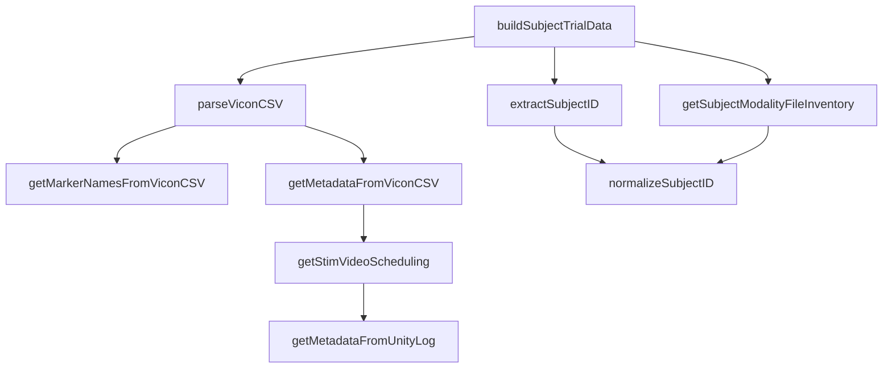
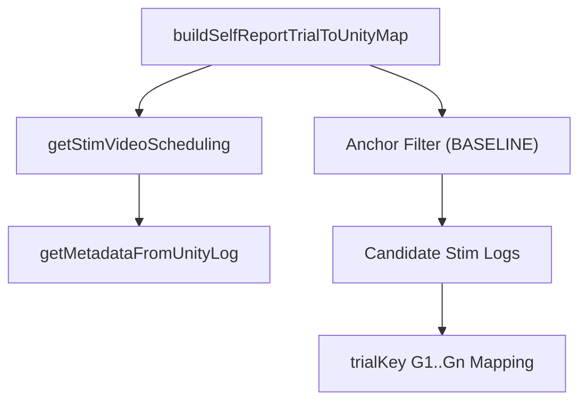
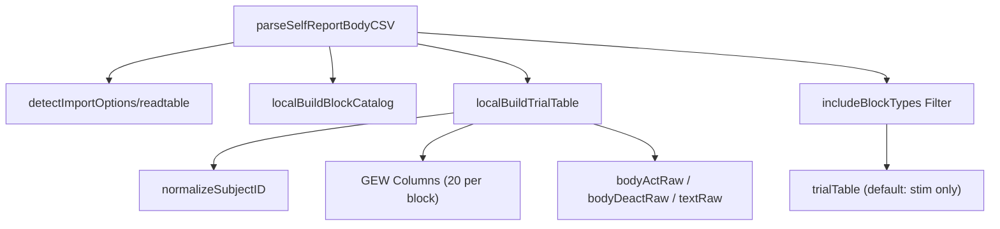
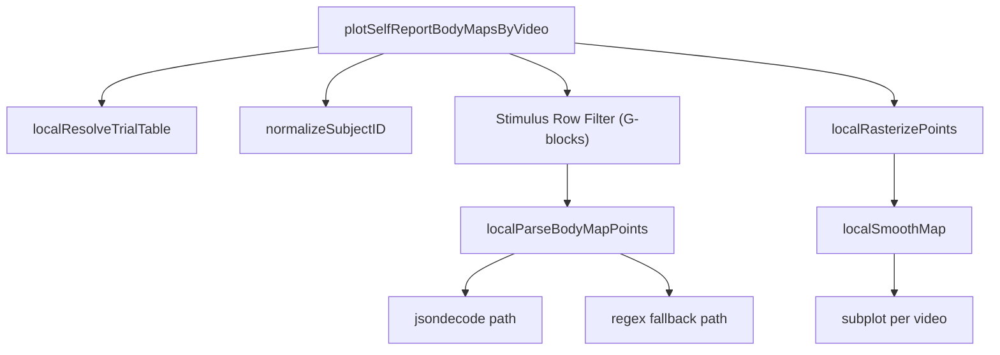
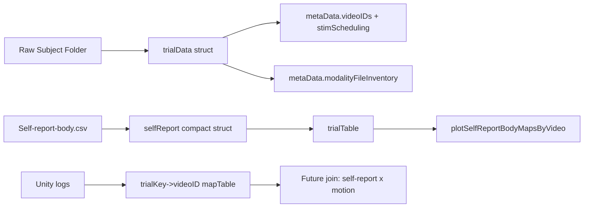

# eMove Architecture Call Graphs

Date: 2026-03-07

This document summarizes current call relationships for the new ingestion and self-report tooling.

## 1) Subject Ingestion Pipeline

## 2) Unity Scheduling + Trial Mapping

## 3) Self-Report Parsing (Wide CSV to Compact)

## 4) Self-Report Body Map Visualization

## 5) Data Objects Passed Between Modules

## 6) Notes

1. Call graphs describe orchestration and parsing only; they do not imply metric computation changes.
2. `plotSelfReportBodyMapsByVideo` currently visualizes self-report maps without emotion coding tables.
3. Mapping from self-report `G1..G15` is currently anchored to logs after `BASELINE` by default.
